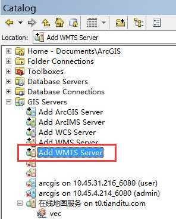
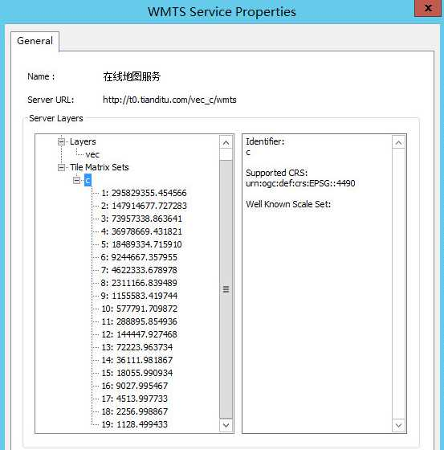

# ArcGIS API for Javascript 4.5 加载天地图WMTS服务示例

在一些涉及到地图功能开发的项目中，会遇到需求方的地图服务是由天地图提供服务的情况。就目前来说，天地图地图服务会以基于 `OGC` 的 `WMTS 1.0.0` 版本标准提供给开发者使用。使用 `OGC` 标准提供服务本身是一件好事，它可以使用任何符合 `OGC` 标准的地图类库加载服务，但是天地图的 `WMTS` 服务标准与 `ArcGIS API for JavaScript 4.x`（后简称：`ArcGIS JSAPI`）中实现的标准并不一致，导致了如果直接使用 `ArcGIS JSAPI`中的`WMTSLayer` 进行图层加载的话会出现地图严重偏离真实位置的情况发生。
目前网上有很多基于 `ArcGIS API for JavaScript 3.x` 的解决方案，但是基于4.x版本API的可运行解决方案很难找到，为了解决这个问题，本文将介绍如何正确的使用 `ArcGIS JSAPI` 加载天地图的 `WMTS` 服务工作的基本流程和一些需要注意事项。
本文中介绍的基本流程需要使用 `ArcMap 10.x` 版本进行 `WMTS` 服务详细参数的查看，并且使用 [t0.tianditu.com/vec_c/wmts](t0.tianditu.com/vec_c/wmts) 服务为示例。 
## 开始
首先，使用 `ArcMap` 中的 `ArcCatalog` 功能，找到 `GIS Servers` 项中的 `Add WMTS Server` 选项并打开（如下图）：  
  
将 [t0.tianditu.com/vec_c/wmts](t0.tianditu.com/vec_c/wmts) 填入 `URL` 中点击OK确认，并在 `GISServer` 中的 `在线地图服务 on t0.tianditu.com` 中选择 `vec` 图层打开如下图：  
  
从属性中能够得到的信息就是地图服务的坐标系是 `EPSG: 4490`，从左侧栏可知该地图服务一共有`19`个缩放级和每个缩放级的比例尺除数（`ScaleDenominator`），我们需要将比例尺除数和缩放级的对应关系记录下来，以供后续计算使用。至此，`ArcMap`的上的工作全部完成。
接下来就只有地图API的操作了
目前我们已经获得的信息有：
- 所有的缩放级
- 所有缩放级对应的比例尺除数（`ScaleDenominator`）

但是，使用 `ArcGIS JSAPI` 中的 `WebTileLayer` 加载WMTS切片时需要使用 `TileInfo` 这个类，而在这个类中需要定义 `level`，`scale`，`resolution` 三个参数，而目前我们从地图服务中获取的信息只有两个，分别对应：
- level -> 缩放级
- scale -> 缩放级对应的比例尺除数

那么还有一个参数 - `resolution` 应该如何获取呢？
其实，resolution是可以根据已有的信息计算出来的，它主要基于下面这个公式：  
  
公式中：
- Scale：1 除以 比例尺除数（ScaleDenominator）
- DPI：Dots per Inch，天地图使用的是96 
- inchToMeterRation：inch 转 meter 的转换系数，一般为0.0254
- 公式中还有一个隐藏的变量就是米转地球球面上的度的转换参数，为 111194.872221777 

现在我们就可以根据已有的数据将我们所需要的每一个比例尺的resolution计算出来了，计算公式如下：  
  
- scaleDenominator：WMTS服务中的缩放级对应的比例尺除数 
- inchToMeterRatio:   inch 转 meter 的转换系数，一般为0.0254 
- DPI：Dots per Inch，天地图（WKID: 4490坐标系服务）使用的是96 
- meterToRadiusRatio：米转地球球面上的度的转换参数，使用111194.872221777 

这样我们就可以将每个缩放级别的Resolution计算出来了，并拼接成 `TileInfo` 类需要的格式，其他配置保持默认。代码如下：
```javascript
 // WGS84（WKID:4326）坐标系DPI
  var dpi = 96;
  // 米 -> 度（地球球面） 转换系数
  var meterToRadiusRatio = 111194.872221777;
  // 英尺 -> 米 转换系数
  var inchToMeterRatio = 0.0254000508;

  //天地图底图缩放等级，从WMTS服务中获取
  var zoomLevels = [1, 2, 3, 4, 5, 6, 7, 8, 9, 10, 11, 12, 13, 14, 15, 16, 17, 18, 19];
  //天地图底图Scale Denominator，从WMTS服务中获取
  var scaleDenominators = [
    295829355.454566,
    147914677.727283,
    73957338.863641,
    36978669.431821,
    18489334.71591,
    9244667.357955,
    4622333.678978,
    2311166.839489,
    1155583.419744,
    577791.709872,
    288895.854936,
    144447.927468,
    72223.963734,
    36111.981867,
    18055.990934,
    9027.995467,
    4513.997733,
    2256.998867,
    1128.499433
  ];

  // 通过Scale Denominator计算分辨率
  function calcResolution(scaleDenominator) {
    return scaleDenominator * inchToMeterRatio / (dpi * meterToRadiusRatio);
  }

  // 用于存储不同缩放等级下的切片信息的LOD数组对象
  var lodsArray = [];

  zoomLevels.map(function(zoomLevel, idx) {
    var scaleDenominator = scaleDenominators[idx];
    lodsArray.push({
      level: zoomLevel,
      resolution: calcResolution(scaleDenominators[idx]),
      scale: scaleDenominators[idx]
    });
  });

  var tileInfo = new TileInfo({
    "rows": 256,
    "cols": 256,
    "compressionQuality": 0,
    "origin": {
        "x": -180,
        "y": 90
    },
    "spatialReference": {
        "wkid": 4326
    },
    "lods":lodsArray
  });
```

好了，最关键的步骤已经完成，让我们使用 `WebTileLayer` 类将天地图的切片加载进地图吧：
```javascript
 var tileInfo = TdtTileInfo;
  var spatialReference = new SpatialReference({ wkid: 4326 });
  var fullextent = new Extent({
    xmax: 148.028515625,
    xmin: 63.74140625000001,
    ymax: 55.25888671875,
    ymin: 15.795996093749999,
    spatialReference: spatialReference
  });

  var map = new Map({});
  var view = new MapView({
    map: map,
    container: "map",
    center: [118.78, 32.04],
    zoom: 10
  });

  view.then(function() {
    var layerList = new LayerList({
      view: view
    });
    view.ui.add(layerList, "bottom-left");
  });

  esriConfig.request.corsEnabledServers.push("t0.tianditu.com");
  esriConfig.request.corsEnabledServers.push("t1.tianditu.com");
  esriConfig.request.corsEnabledServers.push("t2.tianditu.com");
  esriConfig.request.corsEnabledServers.push("t3.tianditu.com");
  esriConfig.request.corsEnabledServers.push("t4.tianditu.com");

  var TDT_Layer = new WebTileLayer({
    id: "TiandituBase",
    title: "Tianditu BaseLayer",
    tileInfo: tileInfo,
    spatialReference: spatialReference,
    urlTemplate: TdtUrlTemplates.TDT,
    subDomains: ["t0", "t1", "t2", "t3", "t4"]
  });

  map.addMany([TDT_Layer]);
});
```
代码中的 `TdtTileInfo` 为之前定义好的天地图切片实例，`TdtUrlTemplates.TDT` 为 [t0.tianditu.com/vec_c/wmts](t0.tianditu.com/vec_c/wmts) 的加载路径规则，具体如下：
```javascript
define(function() {
  var urlTemplatesObject = {
    TDT: "http://{subDomain}.tianditu.com/vec_c/wmts?SERVICE=WMTS&request=GetTile&version=1.0.0&LAYER=vec&tileMatrixSet=c&TileMatrix={level}&TileRow={row}&TileCol={col}&style=default&format=tiles"
  };
  return urlTemplatesObject;
});
```
路径加载规则如何获取网上很多教程里都有，这里就不再赘述了。好了，那么现在我们就可以使用 `ArcGIS JSAPI` 来加载天地图的 `WMTS` 底图服务切片了。
## 注意！
出于某些安全因素的考量，使用这种从WMTS服务中获取参数并进行切片分辨率和比例尺计算的方法获得的底图上的坐标值并不是真实的坐标值，这是因为天地图在暴露给外部使用的 `WMTS` 服务中的缩放级别和比例尺并不是行切片制作时的真实值，他们以这种方式来对地图上的经纬度坐标信息进行混淆和加密。这样就会造成使用真实经纬度的点加载到这种底图上时会有一定的偏移，解决这个问题有两种方法：
#### 方法1：使用解密后的切片加载参数（代码如下）
```javascript
   var tileInfo = new TileInfo({
        "rows": 256,
        "cols": 256,
        "compressionQuality": 0,
        "origin": {
            "x": -180,
            "y": 90
        },
        "spatialReference": {
            "wkid": 4326
        },
        "lods": [{
            "level": 2,
            "resolution": 0.3515625,
            "scale": 147748796.52937502
        },
        {
            "level": 3,
            "resolution": 0.17578125,
            "scale": 73874398.264687508
        },
        {
            "level": 4,
            "resolution": 0.087890625,
            "scale": 36937199.132343754
        },
        {
            "level": 5,
            "resolution": 0.0439453125,
            "scale": 18468599.566171877
        },
        {
            "level": 6,
            "resolution": 0.02197265625,
            "scale": 9234299.7830859385
        },
        {
            "level": 7,
            "resolution": 0.010986328125,
            "scale": 4617149.8915429693
        },
        {
            "level": 8,
            "resolution": 0.0054931640625,
            "scale": 2308574.9457714846
        },
        {
            "level": 9,
            "resolution": 0.00274658203125,
            "scale": 1154287.4728857423
        },
        {
            "level": 10,
            "resolution": 0.001373291015625,
            "scale": 577143.73644287116
        },
        {
            "level": 11,
            "resolution": 0.0006866455078125,
            "scale": 288571.86822143558
        },
        {
            "level": 12,
            "resolution": 0.00034332275390625,
            "scale": 144285.93411071779
        },
        {
            "level": 13,
            "resolution": 0.000171661376953125,
            "scale": 72142.967055358895
        },
        {
            "level": 14,
            "resolution": 8.58306884765625e-005,
            "scale": 36071.483527679447
        },
        {
            "level": 15,
            "resolution": 4.291534423828125e-005,
            "scale": 18035.741763839724
        },
        {
            "level": 16,
            "resolution": 2.1457672119140625e-005,
            "scale": 9017.8708819198619
        },
        {
            "level": 17,
            "resolution": 1.0728836059570313e-005,
            "scale": 4508.9354409599309
        },
        {
            "level": 18,
            "resolution": 5.3644180297851563e-006,
            "scale": 2254.4677204799655
        }]
    });
```
使用这种方式的好处是非常简单，直接使用参数进行图层的加载可以在一定精度上解决切片上坐标变形的问题，但是这种方案只限于对精度要求不高的场景使用，经本人测试发现这种加载方式在大比例尺下的偏移是100m级的，所以对一些需要精准定位的场景而言并不适用，需要使用第二种解决方法。
#### 方法2：使用需求方提供的坐标加密/解密专用接口
这种接口可以完成两种工作：
传入加密后的经纬度坐标，返回真实经纬度坐标，用于数据返回。
传入真实的经纬度坐标，返回经过加密的经纬度坐标，用于地图展示。 
对于线和面等复杂的图层类型需要与需求方协商做整体转换和服务发布，并加载转换后的服务来解决坐标偏移的问题。
相信如果是使用天地图为底图且有高精度要求的场景下，需求方是一定会提供方法2中的相关内容的，如果是自己的项目没有强制要求的话，尽量避免使用天地图的WMTS服务。
## 结语
文中已经将在实际项目中遇到的使用 `ArcGIS JSAPI` 加载天地图 `WMTS` 服务的一些经验和方法在文章中做了总结，并对涉及工作流程和原理的部分做了概述。希望能够帮助到读到此文的各位。
对文中一些原理性的内容我也不是说非常了解，只是结合自己的GIS背景及使用中的一些经验做了自己的解读，可能有一些不准确的地方，如若各位能够提出修改建议我将会非常感谢。如果对于各位有帮助的话欢迎加星，对于代码层面的改进也欢迎在ISSUE中提出，谢谢！

